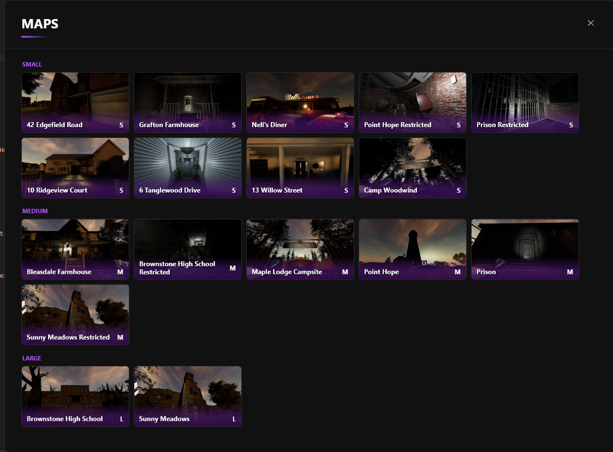
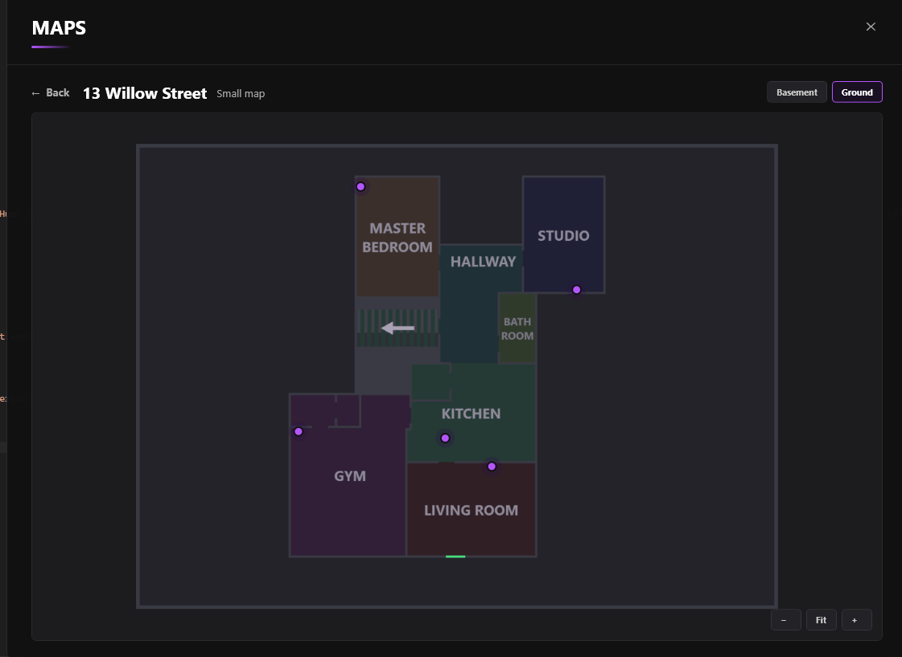
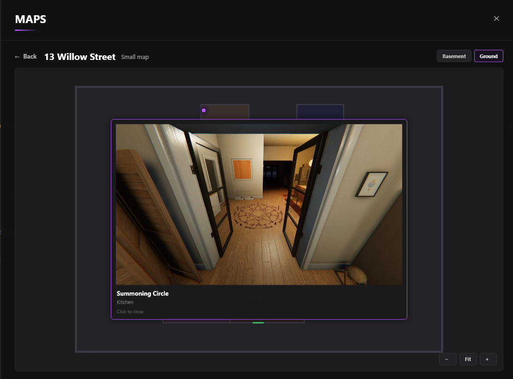

Hi, I want to share an early look at whats coming in 1.3.0. This update will specifically focus on **FINALLY** adding map support to the overlay. 

To start, there will be a new hotkey. **M** (default). When pressed, you will be greated 
with a menu that looks something like this (subject to change)

You will have an overview of all the maps, with their names & images of the map to 
help you easily just find the map you're looking for. They're grouped by map sizes. When you click into them, you will be greeted with something like this.

As you can see, you can cycle between the floors on the building, as well as see where all the cursed possessions live, where the exit door is and just where the rooms are. As well as that, you will be able to see the breaker locations. If you click on one of the cursed item, you will be shown the cursed object in the real map to 
help you find it.

I know this looks quite barebones at the moment, and that's because it is. The icons will be changed and replaced with some custom icons for all the 7 cursed objects. and the UI will have some refinements, but the general feel will remain the same. 

I know I don't have a ton to show off right now, but I'm hoping to have a lot more to show later in the month. And of course, the map feature will also come to PhasOverlay Web at the same time as PhasOverlay. 

Thanks for reading, and I hope to share more soon! 